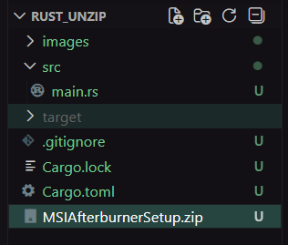
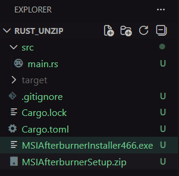
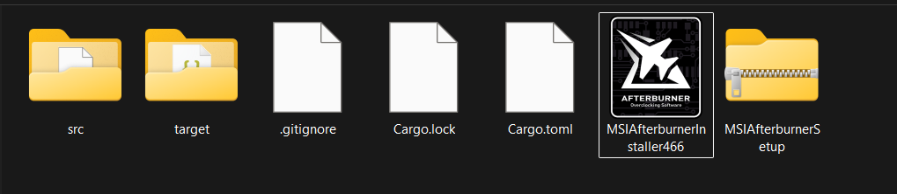

# Jalebi 🌀

A **cross-platform command-line zip extraction tool** written in Rust.

This project allows users to extract `.zip` archives directly from the terminal with clear build and extraction status messages. It is designed to be **simple and safe**, suitable for real-world CLI workflows.

---

## Features

* Extracts standard **ZIP** archives
* **Cross-platform** (Windows, Linux, macOS)
* Fast native execution using Rust
* Safe file handling (no unsafe code)
* Extracts files to the **same directory** as the ZIP
* Clear terminal status messages (`BUILDING…`, `Extracting…`, `COMPLETED`)

---

## Tut

### Output

 


### Extracted Files



---

## Installation 

### 1. Prerequisites

* **Rust** (stable)
* **Cargo** (comes with Rust)

Verify installation:

```bash
rustc --version
cargo --version
```

---

### 2. Clone the Repository

```bash
git clone https://github.com/yh01yb/jalebi.git
cd jalebi
```

---

### 3. Build the Project

```bash
cargo build
```

---

## Usage

Run the program by passing the zip file name as an argument:

```bash
cargo run -- your_file.zip
```

### Example

```bash
cargo run -- MSIAfterburnerSetup.zip
```

### Output

```text
BUILDING...
Extracting: MSIAfterburnerInstaller466.exe
COMPLETED 
```

The files will be extracted **in the same directory** as the ZIP file.

---

## Project Structure

```text
rust-unzip/
├── src/
│   └── main.rs
├── target/
├── images/
│   ├── before.png
│   └── after.png
├── Cargo.toml
├── Cargo.lock
├── .gitignore
└── README.md
```

---

## Supported File Types

This tool extracts **ZIP containers**, not specific file formats.

That means it can unzip archives containing:

* PDFs, text files
* Images (PNG, JPG, etc.)
* Executables (`.exe`)
* Game assets
* Any binary or text file

---

## 🧪 Development Notes

* Multiple ZIP files can be extracted **one after another**
* No need to run `cargo clean`
* `cargo run` recompiles only if code changes

---

## Author

**aditya**
🦀
---

> *"Small, fast tools done right."* 🦀

